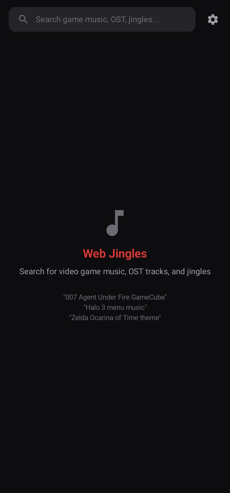
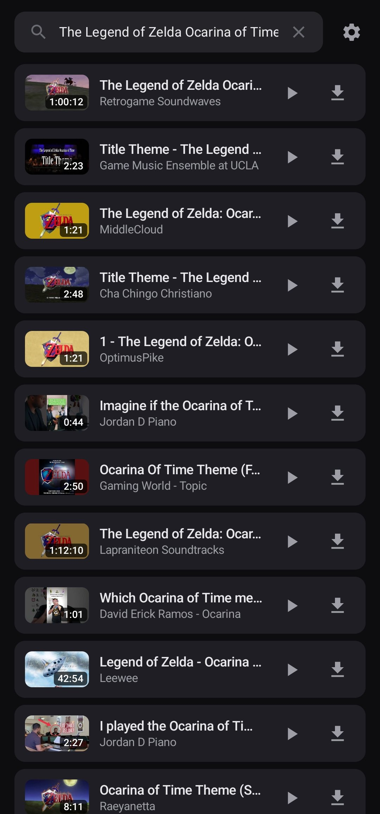
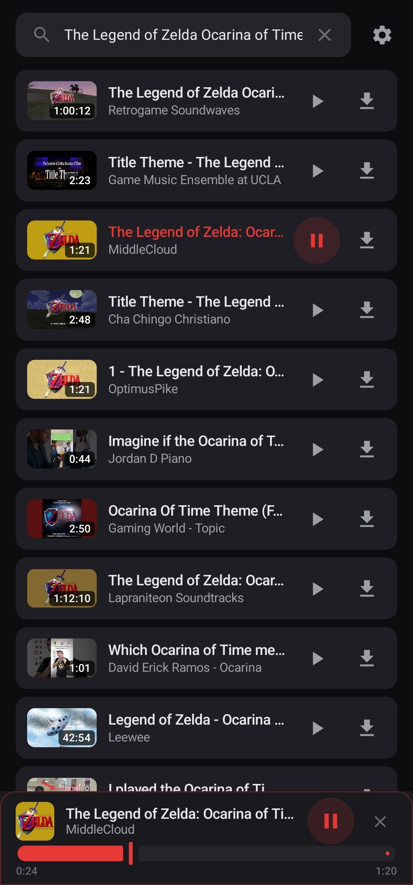
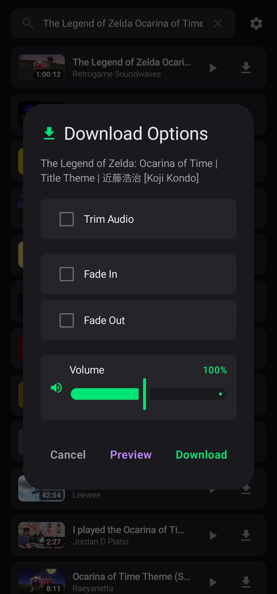
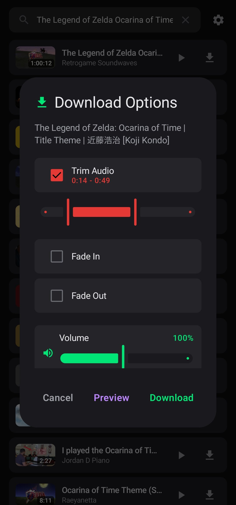
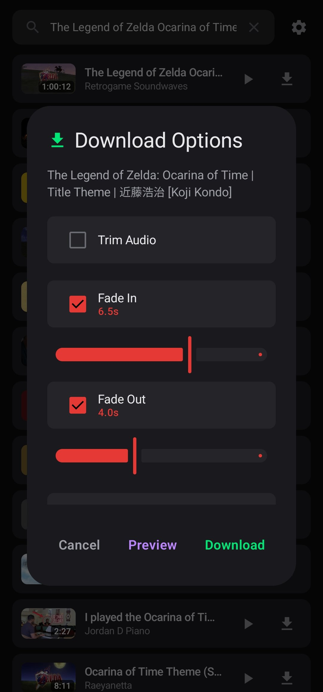
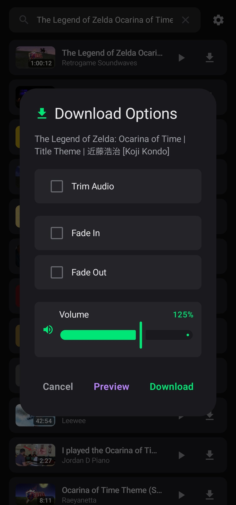
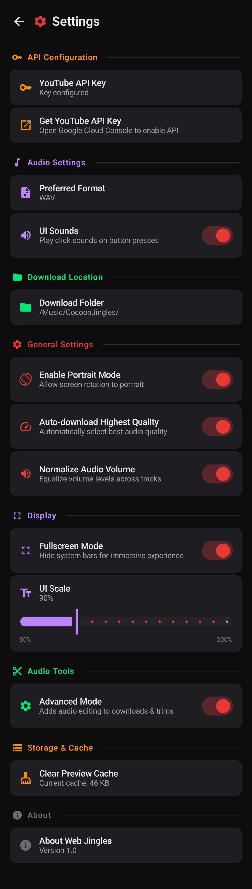

# Web Jingles

Web Jingles is a lightweight Android application that allows users to search, preview, and download game themes and OSTs using the YouTube Data API v3. The app is designed to be fast, minimal, and highly customizable, giving users full control over how audio is searched, processed, and saved.

Downloaded audio files are saved by default to:  
`/Music/WebJingles/` (fully customizable in settings)

The app focuses on flexibility, allowing users to adjust audio quality, formatting, UI behavior, and processing tools depending on their needs.

This is **Beta 2.0**, meaning the app is still under active development with features being refined and expanded.

---

## Download

  

Or manually:

- Go to the **Releases** section  
- Open the latest release  
- Download the APK from **Assets**  
- Install on your Android device  

---

## App Icon

  

---

## Main Screen

  

The main interface provides a simple and fast search experience for finding game OSTs and themes.

### Features
- Central search bar for YouTube-based music search  
- Built-in search history dropdown  
- Quick access settings button  

---

## Search Results

  

Displays a list of songs fetched from YouTube based on the user’s search query.

### Features
- List of tracks with titles and metadata  
- Play button for instant preview  
- Download button for each track  

---

## Now Playing Panel

  

Shows the playback interface when a song is selected.

### Features
- Now playing overlay panel  
- Active playback controls  
- Visual indication of currently selected track  

---

## Download Options

  

Displays download configuration options before saving audio.

### Features
- Preview before download  
- Confirm download button  
- Cancel option  
- Optional processing settings  

---

## Trimming Tool

  

Allows users to trim audio before downloading.

### Features
- Start/end trimming  
- Precise audio cutting  
- Preview before export  

---

## Fade Controls

  

Audio enhancement options for smoother transitions.

### Features
- Fade-in toggle  
- Fade-out toggle  

---

## Volume Controls

  

Controls output audio level before download.

### Features
- Volume slider  
- Audio normalization support  

---

## Settings Panel

  

Full configuration hub for customizing the app experience.

### API Configuration
- YouTube API Key input  
- Get API Key button  

### Audio Settings
- Preferred format (MP3 / WAV)  
- UI Sounds toggle  

### Download Location
- Custom folder selection  

### General Settings
- Portrait mode toggle  
- Auto-download highest quality toggle  
- Normalize audio volume toggle  
- Better Search toggle (ON by default)  
  - ON: standard search queries  
  - OFF: enhances results with “game music OST” expansion  

### Display Settings
- Fullscreen mode toggle  
- UI scale slider  

### Audio Tools
- Enable trimming & fade tools toggle  
- OFF = instant download  
- ON = advanced editing tools  

### Storage & Cache
- Clear preview cache button  

### About
- App name  
- Version Beta 2.0  

---

## YouTube Data API v3 Setup

Web Jingles requires a YouTube Data API v3 key.

### Steps:

1. Open Google Cloud Console  
   https://console.cloud.google.com/

2. Create a new project  

3. Enable YouTube Data API v3  
   - APIs & Services → Library  
   - Search and enable API  

4. Create credentials  
   - APIs & Services → Credentials  
   - Create API Key  

5. Copy your API key  

6. Open Web Jingles → Settings  
   - Paste API key into input field  

### Important Notes:
- Do NOT share your API key publicly  
- API usage is subject to Google quota limits  
- If search stops working, check quota usage  

---

## Tech Stack

- Kotlin / Java  
- Android Studio  
- YouTube Data API v3  
- Audio processing libraries  

---

## Permissions

- Internet access (YouTube search)  
- Storage access (downloads)  
- Media playback  

---

## Roadmap

- Add support for automated track discovery and improved recommendations  
- Integrate preset-based support for Cocoon-style audio configurations and themes  

---

## Known Issues

- No major issues reported in this version  

---

## Credits

- YouTube Data API v3  
- Android Open Source Project  
